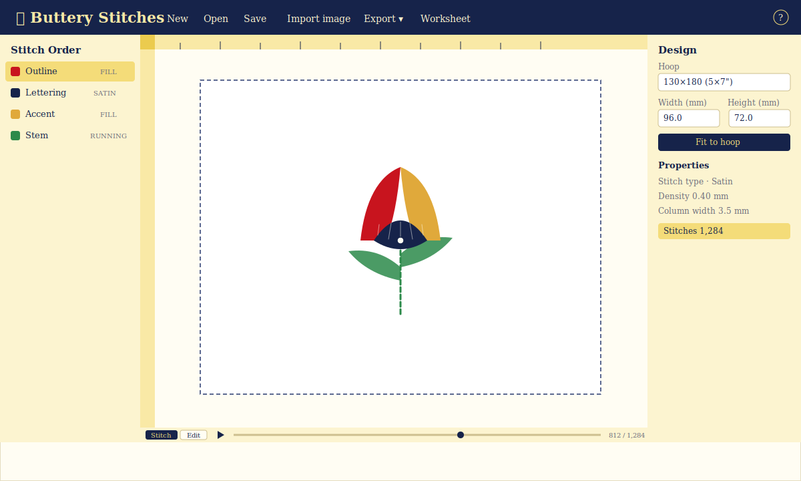

# 🧈 Buttery Stitches

A free machine-embroidery digitizer that runs **entirely in your browser**. Drop
in a logo, turn it into stitches, tidy it up in a vector-style editor, and export
a file your machine can actually read — PES, DST, JEF, EXP, or VP3. Nothing ever
leaves your computer.

**Live:** [buttery-stitches.suzie.fun](https://buttery-stitches.suzie.fun)

I made this because I wanted to digitize my own designs without paying for heavy
desktop software or uploading my art to someone's server. It's named after my
dog, Butters — hence the butter-yellow-and-navy theme, the serif wordmark, and
rulers styled like the marks on a stick of butter.



It's happiest with **clean logos, lettering, and limited-color artwork**. It is
*not* a photo converter — feed it a photograph and you'll get a rough, heavily
posterized result (with a warning). That's on purpose.

## What you can do

- **Auto-digitize an image.** Import a logo and it traces, simplifies, and turns
  it into fill/running objects — adjustable color count, background removal,
  despeckle.
- **Add text.** Type something, pick a font (Oswald — tuned for embroidery — plus
  Poppins, Playfair Display, Roboto Slab, Pacifico), set the size, drop it in.
  Curve it onto a **circle** or along a **path** for badges and arches.
- **Draw by hand.** Running, satin, and fill tools, with a **Curve** mode for
  smooth lines instead of stiff polygons.
- **See real thread.** A "TrueView" 3D mode renders each stitch as lit, fuzzy
  floss — soft fibers and a downy halo — so the preview reads like the real
  stitch-out, not flat vector color.
- **Edit like vectors.** Move, scale, rotate, drag individual nodes, reorder the
  stitch sequence, copy/paste (⌘/Ctrl + C/V), tweak density and angles.
- **Outline a fill** with a satin border in another color, one click.
- **Size it to your hoop.** Hoop presets or custom, fit-to-hoop, aspect lock.
  Measurements are in **inches** by default (switch to mm anytime).
- **Watch it sew.** A stitch simulator redraws the design needle-by-needle so you
  can catch problems before you hoop a single thing.
- **Export & print.** PES/DST/JEF/EXP/VP3, plus a printable thread worksheet with
  the color order, swatches, and stitch counts.

## Stitch quality

The whole point is files that actually sew well. It's **pure math and logic — no
AI** — so every result is deterministic, explainable, and reproducible: the same
input always gives the same stitches.

**The fundamentals** are all baked in: low-density underlay (inset so it never
peeks past the top), push/pull compensation, tie-in/tie-off lock stitches so
threads don't pull out, minimum-stitch filtering so the needle doesn't jam, and
split throws on wide satin.

**Intelligent auto-digitizing** is where it tries to beat the desktop tools. It
reads the *shape* of each region and picks the stitch a hand digitizer would:

- **Smart shape recognition** snaps a wobbly trace to a clean circle, ellipse,
  rectangle, or regular polygon when that's clearly what it is.
- **Automatic stitch-type assignment** from the region's geometry — hairlines run
  down their centerline, strokes and lettering become satin columns, broad areas
  become tatami, and round shapes / thin ring-bands fill as concentric **contour**
  rows. A broad blob with a hole punched in it (a bun around a sausage) fills as
  flat tatami, not topographic rings.
- **Line-art over fills.** Auto-digitize separates each colour's *thin, elongated*
  regions — bold outlines, fur/detail strokes — from its solid blobs, sewing the
  strokes as clean **running lines down their centerline** (the line follows the
  stroke's own direction) laid ON TOP of the fills, the way a digitizer outlines a
  shape, instead of filling them into fragmented slivers or a heavy satin zig-zag.
  Solid features (an eye, a nose) fill solid rather than spiralling as tiny contour
  rings.
- **Turning (directional) fills.** A curved, elongated shape — a banner, a leaf, a
  crescent, a sausage — is filled with rows that *follow the curve* (laid
  perpendicular to the shape's medial spine) instead of one flat angle, the way a
  hand digitizer would. Round, straight, notched, or fragmented shapes keep the
  fixed-angle fill; turning fill bows out cleanly (never slashes) when it doesn't fit.
- **Fewest-fragments fill angle** (the method in Wilcom's auto-digitize ):
  the tatami angle is the one whose rows break the least across concavities, so a
  U fills as unbroken columns and an E's rows run across its prongs — fewer starts,
  stops, and travels. Convex and gently-organic shapes keep their natural grain.
- **Clean edges.** Each broad fill gets a finishing **edge run** just inside the
  outline so the silhouette and end-caps read crisp.
- **Concavity-aware fills.** Wavy, notched, and crescent shapes are filled with a
  **boustrophedon decomposition** — the region is split into cells and the fill
  travels *inside* the shape between them (or trims when the detour is too far),
  so the serpentine never slashes a stray thread across an open notch.
- **Trim economy.** Like a hand digitizer, it travels *under* existing stitches
  instead of cutting. Before any same-color move would trim, it looks for a path
  that stays hidden beneath the design's coverage (an A* over a coverage grid) and
  buries the travel there; contour rings additionally sew as one outer→inner
  **spiral**. A test crest's hot-dog dropped from 27 trims to 3 (only the
  unavoidable colour changes) — matching the ~1 trim / 1000 stitches of pro files.
- **Mitered satin junctions, short-stitched curves, knockdown/trapping** where
  fills meet, and **travel-optimized** sewing order (2-opt) to cut jumps.

The reasoning is written up in
[`docs/embroidery-quality.md`](docs/embroidery-quality.md) and
[`docs/stitch-logic.md`](docs/stitch-logic.md), and it's all pure, unit-tested
code — the same engine drives both the on-screen simulator and the exported file,
so what you see is what you get.

## How it works under the hood

- **No backend.** It's just static files. Your images and designs stay on your
  machine.
- **Real file formats, not my homegrown guesses.** Writing PES/DST/etc. is handled
  by [`pyembroidery`](https://github.com/EmbroideryHub/pyembroidery), run in the
  browser with [Pyodide](https://pyodide.org/) (WebAssembly).
- **Everything is in millimeters internally**; it only converts to the embroidery
  format's units at the moment of export. Keeps the math sane.
- **The `.embproj` file is the source of truth** — plain JSON with your colors,
  objects, and their order (which *is* the stitch sequence). It's lossless and
  re-editable. An exported `.pes` is lossy, so don't try to round-trip it back.

## Run it locally

```bash
npm install
npm run dev        # dev server
npm test           # unit + component tests
npm run typecheck  # types
npm run lint       # lint
npm run build      # production build
```

Needs Node 22.

## Keyboard shortcuts

| Key | Action | Key | Action |
| --- | --- | --- | --- |
| `V` | Select | `⌘/Ctrl Z` / `⇧Z` | Undo / Redo |
| `N` | Node edit | `⌘/Ctrl C` / `V` | Copy / Paste |
| `R` `S` `F` | Running / Satin / Fill | `⌘/Ctrl D` | Duplicate |
| `Enter` / `Esc` | Finish / cancel a shape | `⌘/Ctrl S` | Save `.embproj` |
| `Del` | Delete selection | `P` | Toggle stitch view |
| `?` | Shortcut help | `Space` | Play / pause simulation |

## Hosting

It deploys itself to GitHub Pages on every push to `main` (see
`.github/workflows/deploy.yml`). The build uses a relative base path, so it'll
run from any static host or sub-path too.

## License

MIT — see [LICENSE](LICENSE). Built on some lovely open-source work:
`pyembroidery` (MIT), `imagetracerjs` (Unlicense), `opentype.js` (MIT), Konva
(MIT), Zustand + zundo (MIT), and the bundled fonts (SIL OFL 1.1). See
[CONTRIBUTING.md](CONTRIBUTING.md) if you'd like to poke at it.
